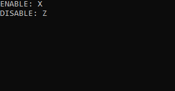

# LPMPUSH
An application that simulates pressing the left mouse button continuously. To use, start the application and select the buttons (must be uppercase) that will be used to turn on and off. 
 

# How to use
1. Run LPMPUSH
2. Input the key you want to enable LPMPUSH with (must be uppercase)
3. Input the key you want to disable LPMPUSH with (must be uppercae)
4. Enable and disable it with the buttons selected before
